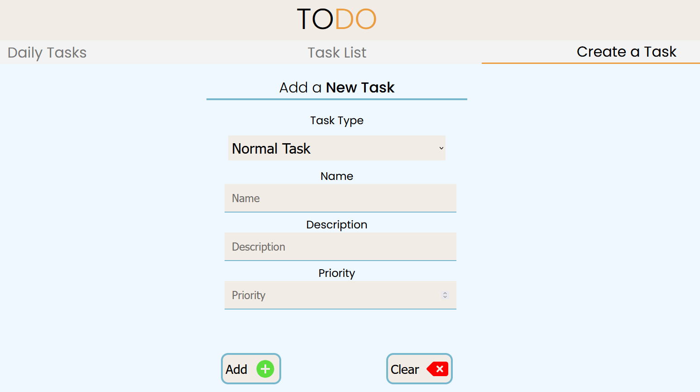

# TODO APP
#### Main Layout:


#### Adding tasks:


App was created as 2 main components: frontend(React) and backend (.NET with C# and Microsoft SQL Server).

## Requirements:
- [Node.js](https://nodejs.org/) 
- [.NET SDK](https://dotnet.microsoft.com/download) (version at least 8.0)

## Running Application:

#### 1. Running the frontend (React) 
In the root directory run:
```bash 
npm install 
```
To start the application:
```bash
npm start
```
Application will probably be availabe at: `http://localhost:3000`

#### 2. Running the Backend (.NET)
Install Dependencies:
```bash
dotnet restore
```
Start the application:
```bash
dotnet run
```
You also have to configure your connection with Microsoft SQL Server, which is in the `appsettings.json` file in the Backend directory.

# ToDoApp.API Documentation

## Table of Contents
1. [DeadlineTask](#deadlinetask)
   - [GET /api/DeadlineTask/GetAll](#get-api-deadlinetask-getall)
   - [GET /api/DeadlineTask/{id}](#get-api-deadlinetask-id)
   - [DELETE /api/DeadlineTask/{id}](#delete-api-deadlinetask-id)
   - [POST /api/DeadlineTask](#post-api-deadlinetask)
   - [PUT /api/DeadlineTask](#put-api-deadlinetask)
   
2. [RecurringTask](#recurringtask)
   - [GET /api/RecurringTask/GetAll](#get-api-recurringtask-getall)
   - [GET /api/RecurringTask/{id}](#get-api-recurringtask-id)
   - [DELETE /api/RecurringTask/{id}](#delete-api-recurringtask-id)
   - [POST /api/RecurringTask](#post-api-recurringtask)
   - [PUT /api/RecurringTask](#put-api-recurringtask)
   
3. [Task](#task)
   - [GET /api/Task/GetAll](#get-api-task-getall)
   - [GET /api/Task/{id}](#get-api-task-id)
   - [DELETE /api/Task/{id}](#delete-api-task-id)
   - [POST /api/Task](#post-api-task)
   - [PUT /api/Task](#put-api-task)

---

## DeadlineTask

### GET /api/DeadlineTask/GetAll
- **Method:** `POST`
- **Tags:** DeadlineTask
- **Request Body:** DeadlineTaskGetRequest
- **Response:**
  - 200 OK: Returns an array of DeadlineTask objects

### GET /api/DeadlineTask/{id}
- **Method:** `GET`
- **Parameters:**
  - `id` (path): UUID
- **Response:**
  - 200 OK: Returns a DeadlineTask object

### DELETE /api/DeadlineTask/{id}
- **Method:** `DELETE`
- **Parameters:**
  - `id` (path): UUID
- **Response:**
  - 200 OK: Task deleted successfully

### POST /api/DeadlineTask
- **Method:** `POST`
- **Tags:** DeadlineTask
- **Request Body:** DeadlineTask
- **Response:**
  - 200 OK: Returns the created DeadlineTask object

### PUT /api/DeadlineTask
- **Method:** `PUT`
- **Tags:** DeadlineTask
- **Request Body:** DeadlineTask
- **Response:**
  - 200 OK: Updates the DeadlineTask object

---

## RecurringTask

### GET /api/RecurringTask/GetAll
- **Method:** `POST`
- **Tags:** RecurringTask
- **Request Body:** RecurringTaskGetRequest
- **Response:**
  - 200 OK: Returns an array of RecurringTask objects

### GET /api/RecurringTask/{id}
- **Method:** `GET`
- **Parameters:**
  - `id` (path): UUID
- **Response:**
  - 200 OK: Returns a RecurringTask object

### DELETE /api/RecurringTask/{id}
- **Method:** `DELETE`
- **Parameters:**
  - `id` (path): UUID
- **Response:**
  - 200 OK: RecurringTask deleted successfully

### POST /api/RecurringTask
- **Method:** `POST`
- **Tags:** RecurringTask
- **Request Body:** RecurringTask
- **Response:**
  - 200 OK: Returns the created RecurringTask object

### PUT /api/RecurringTask
- **Method:** `PUT`
- **Tags:** RecurringTask
- **Request Body:** RecurringTask
- **Response:**
  - 200 OK: Updates the RecurringTask object

---

## Task

### GET /api/Task/GetAll
- **Method:** `POST`
- **Tags:** Task
- **Request Body:** TaskGetRequest
- **Response:**
  - 200 OK: Returns an array of Task objects

### GET /api/Task/{id}
- **Method:** `GET`
- **Parameters:**
  - `id` (path): UUID
- **Response:**
  - 200 OK: Returns a Task object

### DELETE /api/Task/{id}
- **Method:** `DELETE`
- **Parameters:**
  - `id` (path): UUID
- **Response:**
  - 200 OK: Task deleted successfully

### POST /api/Task
- **Method:** `POST`
- **Tags:** Task
- **Request Body:** Task
- **Response:**
  - 200 OK: Returns the created Task object

### PUT /api/Task
- **Method:** `PUT`
- **Tags:** Task
- **Request Body:** Task
- **Response:**
  - 200 OK: Updates the Task object

---

